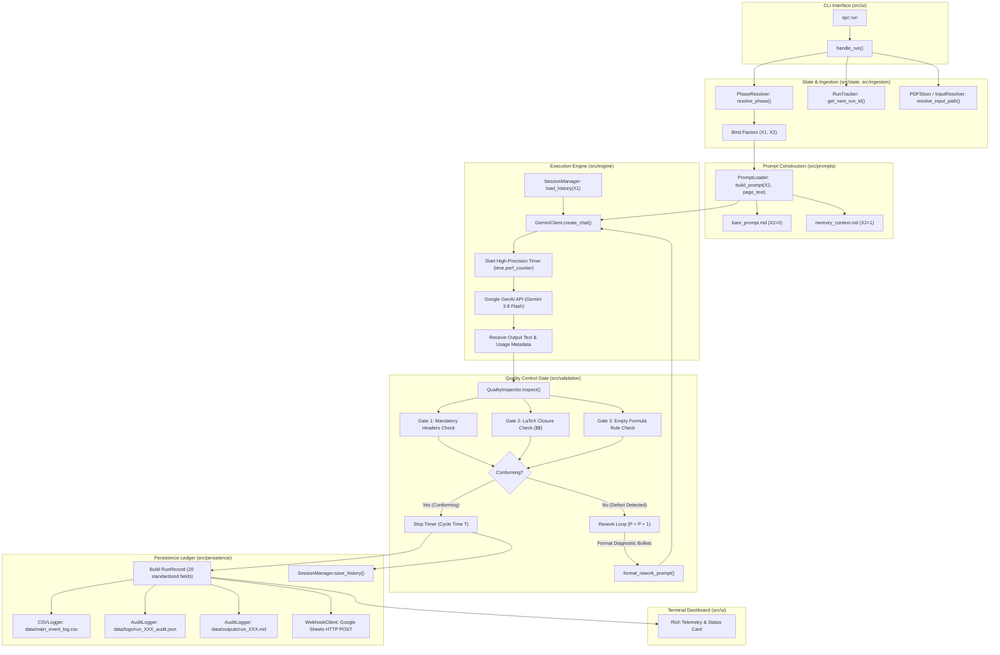

# SPC Transformation Engine — System Architecture

This document details the software architecture, statistical formalization, mathematical token accounting, and subsystem design of the **SPC Transformation Engine**.

---

## 1. Theoretical Framework & Mathematical Formulation

### 1.1 Digital Service Transformation System Formalization

Human-LLM interaction is mathematically modeled as a discrete digital service transformation system:

$$S = (C, R, I, O, F)$$

Where:
* **Components ($C$):** The client execution environment (local CLI runtime $C_0$) and the Google GenAI LLM inference engine ($C_1$).
* **Relationships ($R$):** Directed network topology connecting input ingestion, prompt compilation, API dispatch, deterministic quality inspection, dynamic rework loops, and dual persistence sinks.
* **Inputs ($I$):** Standardized input entities (sliced digital textbook PDF pages) combined with prompt vectors.
* **Outputs ($O$):** Conforming structured Markdown artifacts conforming to technical schema, and rejected runs routed to rework.
* **Transformation Function ($F$):** Stochastic mapping $F: I \times X \rightarrow O$, parameterized by the internal state vector $X = (X_1, X_2)$.

---

### 1.2 The Governing Response Transfer Function

The engine empirically isolates and models the governing linear transfer function:

$$Y = \alpha_0 + \alpha_1 X_1 + \alpha_2 X_2 + \epsilon$$

Where:
* **$Y$ (Primary Response Variable — Cycle Time $T$, in seconds):** The continuous wall-clock duration from initial API request dispatch until a fully compliant, conforming Markdown artifact is produced (including any inspection and rework reflection cycles).
* **$X_1$ (Controllable Factor 1 — Context Buffer Management / WIP State):**
  * $X_1 = 0$: Unbounded accumulation. Conversation history persists across runs, allowing WIP tokens to grow daily.
  * $X_1 = 1$: Zero-WIP policy. Session context buffer is flushed to an empty state prior to each run.
* **$X_2$ (Controllable Factor 2 — External Memory / Schema Calibration):**
  * $X_2 = 0$: Bare ad-hoc prompt (`bare_prompt.md`), providing raw task instructions without structured schema constraints.
  * $X_2 = 1$: Standard Operating Procedure (SOP) schema injection (`memory_context.md`), prepending taxonomy, formatting specifications, and boundary rules.
* **$\alpha_0$:** System baseline latency (model warm-up, connection handshake, minimal generation time).
* **$\alpha_1$:** Context latency coefficient (marginal cycle time per accumulated WIP turn/token).
* **$\alpha_2$:** Schema latency coefficient (impact of SOP instruction overhead vs. reduced variance/rework).
* **$\epsilon$:** Stochastic residual error ($\epsilon \sim \mathcal{N}(0, \sigma^2)$).

---

### 1.3 Statistical Process Control (SPC) Mechanics

To distinguish between **common cause variation** (inherent API latency fluctuations) and **special cause variation** (server throttling, network drops, rework spikes), the continuous primary response variable $Y$ is monitored using **Shewhart Individuals–Moving Range (I-MR) Control Charts** ($n = 2$).

#### 1. Moving Range ($MR$) Calculation
For consecutive observations $T_i$ and $T_{i-1}$:

$$MR_i = |T_i - T_{i-1}|, \quad \text{for } i = 2, 3, \dots, m$$

$$\overline{MR} = \frac{1}{m - 1} \sum_{i=2}^m MR_i$$

#### 2. Process Standard Deviation Estimator ($\hat{\sigma}_0$)
Using the Shewhart unbiasing constant $d_2 = 1.128$ for sample size $n = 2$:

$$\hat{\sigma}_0 = \frac{\overline{MR}}{d_2} = \frac{\overline{MR}}{1.128}$$

#### 3. Control Limits for the Individuals Chart ($I$)

$$\text{Center Line (CL)}_I = \bar{T} = \frac{1}{m} \sum_{i=1}^m T_i$$

$$\text{UCL}_I = \bar{T} + 3 \hat{\sigma}_0 = \bar{T} + 3 \left(\frac{\overline{MR}}{1.128}\right) \approx \bar{T} + 2.6596 \cdot \overline{MR}$$

$$\text{LCL}_I = \max\left(0, \, \bar{T} - 3 \hat{\sigma}_0\right) = \max\left(0, \, \bar{T} - 2.6596 \cdot \overline{MR}\right)$$

#### 4. Control Limits for the Moving Range Chart ($MR$)
Using Shewhart constants $D_3 = 0.0$ and $D_4 = 3.267$ for $n = 2$:

$$\text{CL}_{MR} = \overline{MR}$$

$$\text{UCL}_{MR} = D_4 \cdot \overline{MR} = 3.267 \cdot \overline{MR}$$

$$\text{LCL}_{MR} = D_3 \cdot \overline{MR} = 0$$

#### 5. Process Capability & Performance Indices (Phase IV)
When upper specification limit ($USL$) and lower specification limit ($LSL$) are defined:

$$C_p = \frac{USL - LSL}{6 \hat{\sigma}_0}, \quad C_{pk} = \min\left(\frac{USL - \bar{T}}{3 \hat{\sigma}_0}, \, \frac{\bar{T} - LSL}{3 \hat{\sigma}_0}\right)$$

$$P_p = \frac{USL - LSL}{6 s}, \quad P_{pk} = \min\left(\frac{USL - \bar{T}}{3 s}, \, \frac{\bar{T} - LSL}{3 s}\right)$$

Where $s$ is the overall sample standard deviation: $s = \sqrt{\frac{1}{m-1} \sum_{i=1}^m (T_i - \bar{T})^2}$.

---

## 2. End-to-End System Architecture

The following diagram illustrates the lifecycle of an experimental run from CLI invocation to multi-sink persistence:



---

## 3. Subsystem Decomposition

The codebase strictly adheres to the **Single Responsibility Principle (SRP)** and a **hard 150-LOC ceiling per file**. Every module is organized into a dedicated architectural domain:

```text
src/
├── config.py              # Application settings, directories, Pydantic BaseSettings
├── core/
│   ├── constants.py       # Calendar windows, Phase enum, SPC constants, Gate rules
│   └── models.py          # Pydantic data schemas: RunRecord, DefectReport, AuditPayload
├── state/
│   ├── phase_resolver.py  # Evaluates date against calendar windows to determine (X1, X2)
│   ├── run_tracker.py     # Discovers run IDs and historical counts from CSV
│   └── session_manager.py # Manages session caching, .bak recovery, and audit rebuilding
├── ingestion/
│   ├── input_resolver.py  # Natural-sort discovery of PDF input pages and textbook books
│   └── pdf_slicer.py      # Extracts single PDF pages, evaluates text density bounds
├── prompts/
│   ├── loader.py          # Builds combined prompts, loads SOP and rework templates
│   ├── bare_prompt.md     # Factor X2=0: Unconstrained ad-hoc task prompt
│   ├── memory_context.md  # Factor X2=1: SOP schema, technical taxonomy, boundary rules
│   └── rework_template.md # Dynamic reflection prompt for rework iterations
├── engine/
│   ├── client_factory.py  # Instantiates live GeminiClient or offline MockGeminiClient
│   ├── gemini_client.py   # Wraps google.genai.Client, handles chat and token counting
│   ├── mock_client.py     # Offline simulation client for staged testing
│   ├── mock_responses.py  # Staged conforming and defective markdown payloads
│   └── executor.py        # Orchestrates dispatch, timing, rework loop, and logging
├── validation/
│   ├── rules.py           # Pure deterministic regex inspection functions
│   └── inspector.py       # QualityInspector running the 3 Go/No-Go inspection gates
├── persistence/
│   ├── csv_logger.py      # Appends RunRecord to data/main_event_log.csv (20 columns)
│   ├── audit_logger.py    # Writes forensic JSON audits and accepted markdown outputs
│   └── webhook_client.py  # Real-time HTTP POST dispatcher to Google Apps Script
└── ui/
    ├── cli.py             # Argparse CLI configuration for run, status, slice, rebuild-cache
    ├── handlers.py        # Business handlers executing CLI commands
    ├── views.py           # Rich terminal cards, banners, inspection badges, and tables
    ├── progress.py        # Rich progress bar factory for PDF slicing
    └── slice_handler.py   # Dedicated handler for slicing source textbooks
```

---

## 4. Token Accounting & Input WIP Formalization

### 4.1 Token Invariants & Mathematical Decomposition

In LLM multi-turn interactions, input tokens are not monolithic. The engine formalizes token accounting into 7 distinct metrics, maintaining mathematical invariance:

$$\mathbf{prompt\_tokens}_{\text{ (API Ground Truth)}} = \mathbf{context\_tokens} + \mathbf{instruction\_tokens} + \mathbf{page\_tokens} + \boldsymbol{\epsilon}_{\text{framing}}$$

```text
┌─────────────────────────────────────────────────────────────────────────────────────────────┐
│                             Total API Prompt Tokens (Input WIP W)                           │
├───────────────────────┬─────────────────────────┬──────────────────────┬────────────────────┤
│ context_tokens (WIP)  │ instruction_tokens (X₂) │  page_tokens (Input) │ ε_framing (Markup) │
├───────────────────────┼─────────────────────────┼──────────────────────┼────────────────────┤
│ • Factor X₁           │ • Factor X₂             │ • Input Material (I) │ • Role markers     │
│ • Prior run history   │ • Bare Prompt (~32 t)   │ • Extracted PDF text │ • Turn wrappers    │
│ • 0 in Phase II/III   │ • SOP Schema (~380 t)   │   (~300–600 tokens)  │ • Delimiters       │
└───────────────────────┴─────────────────────────┴──────────────────────┴────────────────────┘
```

1. **`context_tokens` ($X_1$ WIP Buffer):** Tokens residing in conversation history before the run begins. Captured via `client.count_tokens(history)` when $X_1 = 0$, exactly $0$ when $X_1 = 1$.
2. **`instruction_tokens` ($X_2$ Schema Overhead):** Tokens in the prompt template ($\approx 32$ for Bare Prompt, $\approx 380$ for SOP Schema). Isolates the marginal cost of schema injection.
3. **`page_tokens` ($I$ Raw Input Material):** Tokens in the isolated raw textbook page text. Serves as a covariate check to verify uniform input size ($\pm 10\%$).
4. **`framing_tokens` ($\epsilon_{\text{framing}}$ Protocol Overhead):** Provider turn formatting (`<start_of_turn>user`, boundaries). Calculated as:
   $$\boldsymbol{\epsilon}_{\text{framing}} = \max\left(0, \, \mathbf{prompt\_tokens} - (\mathbf{context\_tokens} + \mathbf{instruction\_tokens} + \mathbf{page\_tokens})\right)$$
5. **`prompt_tokens` ($W_{\text{in}}$ Total Input Load):** Direct API telemetry from `response.usage_metadata.prompt_token_count`.
6. **`output_tokens` ($O$ Generation Yield):** Direct API telemetry from `response.usage_metadata.candidates_token_count`.
7. **`total_tokens` ($W_{\text{total}}$ System Footprint):** $\mathbf{prompt\_tokens} + \mathbf{output\_tokens}$.

---

## 5. Work-In-Progress (WIP) & Session Management

The `SessionManager` governs state persistence across experimental runs:

* **Accumulating Buffer ($X_1 = 0$, Phase I):**
  - Following each conforming transformation, the run's prompt and output are appended to `.cache/session_cache.json`.
  - To prevent accidental state loss, every write is mirrored atomically to `.cache/session_cache.bak`.
  - In the event of cache corruption, `SessionManager.rebuild_from_audit_logs()` can automatically reconstruct the exact multi-turn conversation from the forensic audit JSON files in `data/logs/`.
* **Zero-WIP Policy ($X_1 = 1$, Phases II–IV):**
  - The context buffer is cleared before each run.
  - History passed to `GeminiClient.create_chat()` is empty (`[]`).
  - `context_tokens` is recorded as `0`.

---

## 6. Deterministic Inspection Gate & Quality Control

To eliminate subjective human judgment, output quality is inspected through a 3-gate deterministic evaluator (`QualityInspector`):

| Gate | Criterion | Deterministic Inspection Rule | Failure Remediation |
| :--- | :--- | :--- | :--- |
| **1. Structural Completeness** | Mandatory Section Headers | Verifies presence of level-2 headers:<br>• `## Core Synthesis`<br>• `## Technical Taxonomy`<br>• `## Analytical Formulations` | Model failed to scaffold sections; rework prompt lists missing headers. |
| **2. Syntactical Validity** | LaTeX Block Closure | Count of `$$` tokens must be even (`delimiter_count % 2 == 0`). | LaTeX block left open; rework prompt instructs closing all `$$` tags. |
| **3. Empty Formula Rule** | Zero-Defect Handling | If input text has no math formulas, `## Analytical Formulations` must explicitly state `NONE RECORDED`. | Model hallucinated equations or left section blank without required token. |

### Dynamic Reflection Rework Mechanism
When an output breaches any gate:
1. Conformance flag is set to `conforming = 0`.
2. The `QualityInspector` compiles specific diagnostic bullet points detailing the violations.
3. The `TransformationExecutor` formats a dynamic reflection prompt:
   ```markdown
   [REWORK REQUIRED - ATTEMPT #{rework_count}]
   Your previous output failed deterministic quality inspection:
   {defect_bullets}
   Please correct these exact issues and regenerate the full response.
   ```
4. The rework prompt is dispatched within the active chat session, incrementing the rework counter: $P = P + 1$.
5. The timer continues running, capturing the true cost of non-conformance in the primary cycle time metric $Y$.

---

## 7. Persistence & Telemetry Sink Architecture

Every transformation run commits telemetry to three synchronized persistence tiers:

```text
[Engine Execution Completed]
       │
       ├───> 1. CSV Ledger (data/main_event_log.csv)
       │        • 20 standardized, self-documenting columns
       │        • Machine-readable for R, Python, and SPC charting tools
       │
       ├───> 2. Forensic Audit Log (data/logs/run_XXX_audit.json)
       │        • Complete input prompt, raw API metadata, defect logs, timestamps
       │        • Enables 100% bitwise reproducibility and session reconstruction
       │
       ├───> 3. Accepted Artifact Ledger (data/outputs/run_XXX.md)
       │        • Final clean markdown documentation generated by the LLM
       │
       └───> 4. Cloud Webhook Dispatch (Optional: Google Sheets)
                • Asynchronous HTTP POST transmitting 20 metrics in real time
                • Allows live remote monitoring and classroom dashboards
```

---

## 8. Git Hygiene & Experimental Integrity

To maintain repository cleanliness and protect proprietary input data:
* **Tracked Assets:** Production code (`src/`), test suite (`tests/`), configuration docs (`docs/`), environment template (`.env.example`), and project packaging (`pyproject.toml`).
* **Ignored Artifacts:** The entire `data/` directory is ignored by Git (`.gitignore`), encompassing raw textbook source PDFs (`data/raw/`), sliced input pages (`data/inputs/`), generated markdown outputs (`data/outputs/`), forensic audit logs (`data/logs/`), and primary event ledger (`data/main_event_log.csv`). Local caches (`.cache/`), environment secrets (`.env`).
* **Zero Hardcoded Secrets:** No personal identifiers, API keys, or webhook endpoints exist in source code.
